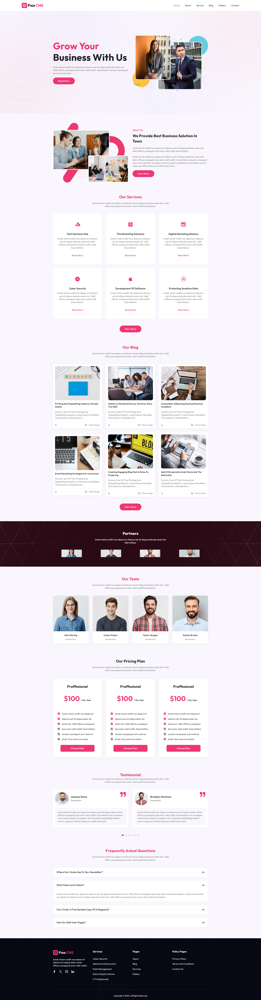
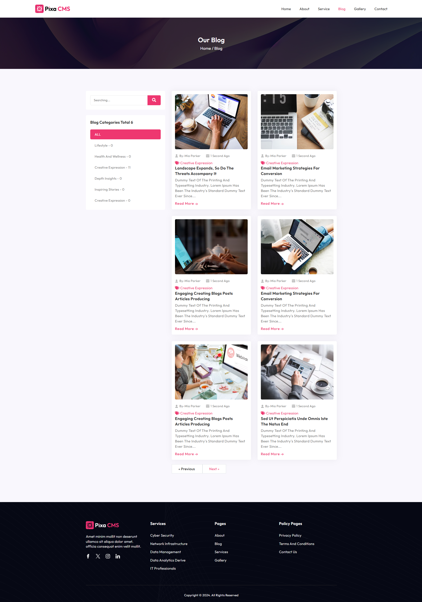
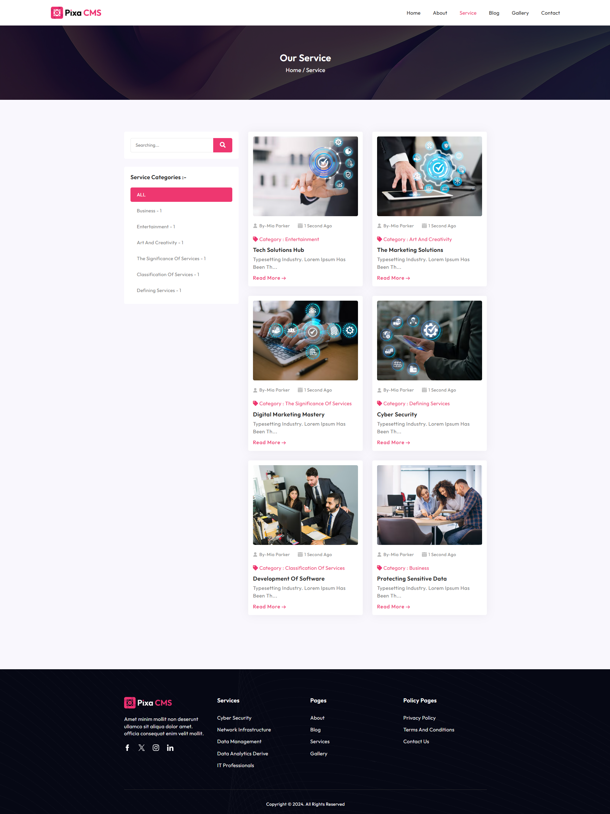
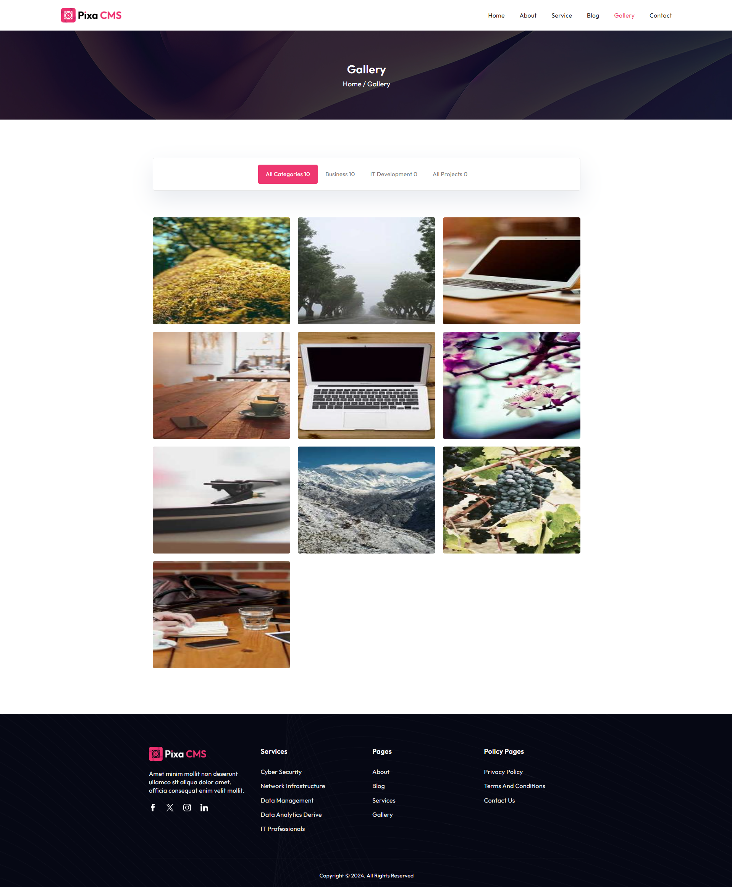
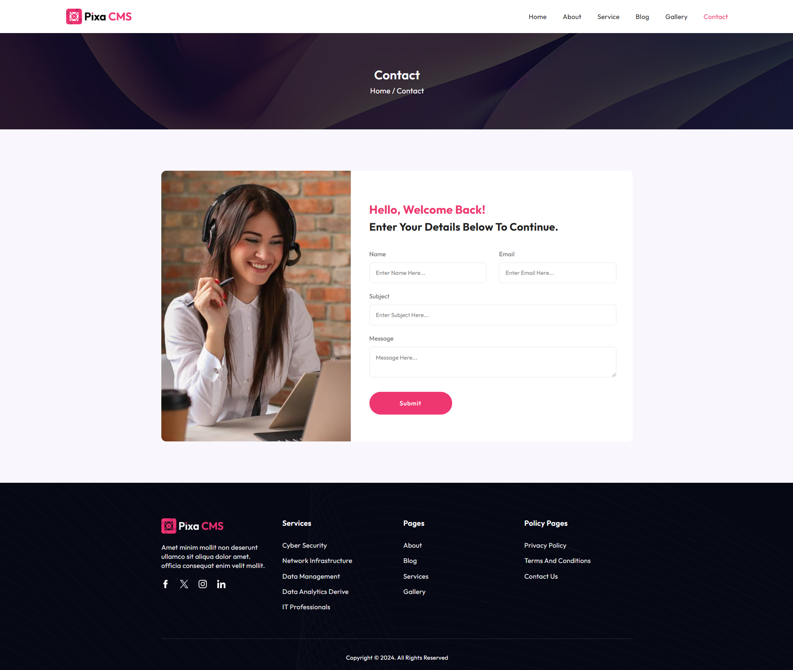

## About Project

CMS – a robust script meticulously developed on the Laravel Framework, seamlessly fusing the elegance of Laravel with advanced content management capabilities. Whether you’re an experienced developer, a digital entrepreneur, or an organization in search of an efficient and customizable CMS, PixaCMS is poised to elevate your web experience.

This powerful script simplifies the creation of dynamic multipage websites with just a few clicks, thanks to its intuitive drag-and-drop builder. The user-friendly admin dashboard empowers administrators to effortlessly control website creation and management. Offering various settings for blog management, service management, pricing plans, testimonials, partners, and more, PixaCMS enables the creation of business sites without the need for coding.

Manage and organize media assets seamlessly with the gallery management feature, enhancing the visual appeal of your site. PixaCMS integrates with Pixabay and Unsplash, simplifying image search and elevating the attractiveness of your website. The multi-language support ensures effortless communication with a global audience.

Explore the potential of PixaCMS, where simplicity meets sophistication, providing a streamlined solution for website creation and management. Transform your digital presence effortlessly with PixaCMS – your gateway to dynamic and visually captivating websites.

 
# Content Management System

Welcome to our CMS (Content Management System)

## Getting Started

To get started with the CMS, follow these steps:

git clone https://github.com/emon21/Contact-management-App/tree/master

# Install composer dependency

composer install

# Install node modules

npm install / yarn

# Copy environment file

cp .env.example .env

# Set the Application key

php artisan key:generate

# setup the database credentials and migrate database

php artisan migrate

# Damy data Insert with Seeder && Factory

php artisan migrate:fresh --seed

### [ Feature List ]

-   Content Management System
-   User Friendly Admin Dashboard
-   Category Management
-   Blog Management
-   Service Management
-   Gallery Management
-   Testimonial Management
-   Pricing Plans
-   FAQ Management
-   Team Management
-   Site Settings
-   Changes Color on Website

# [ Plugins ]

- Fontawsome icon
- Bootstarp Icon
- ColorPiker
- Dropify Image Upload
- Selete2
- Sweet Alert 2
- Toastr Notification
-  Data Table
 
# Frontend

 
# Blog Page
 
# Service Page
 
# Gallery Page
 
 # Contact Page
 

