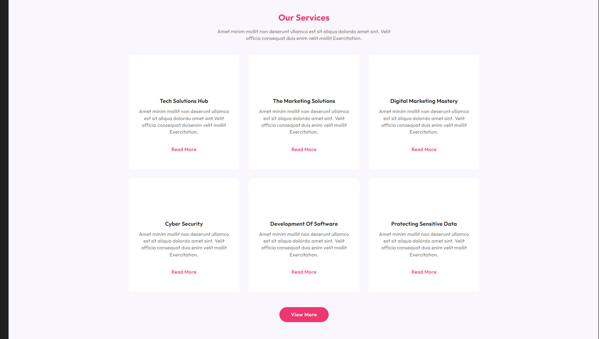
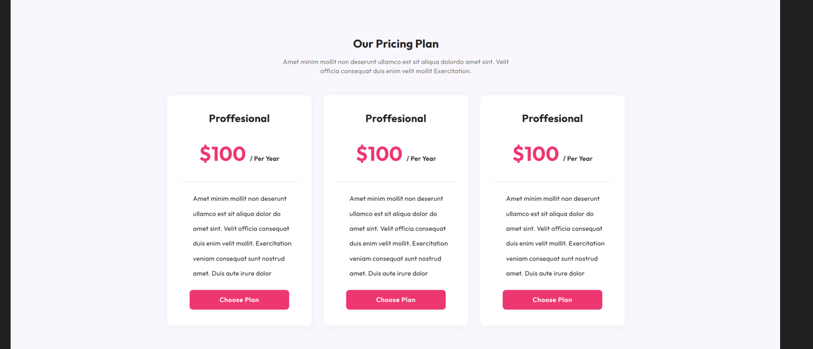
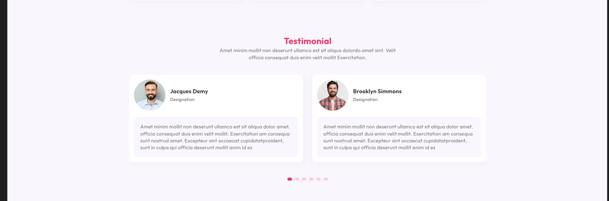
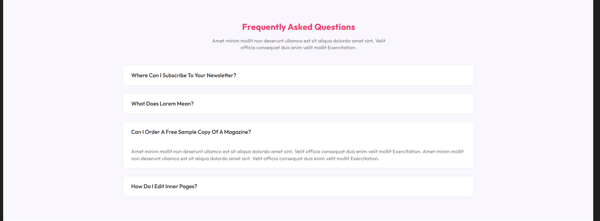

## About Laravel

CMS – a robust script meticulously developed on the Laravel Framework, seamlessly fusing the elegance of Laravel with advanced content management capabilities. Whether you’re an experienced developer, a digital entrepreneur, or an organization in search of an efficient and customizable CMS, PixaCMS is poised to elevate your web experience.

This powerful script simplifies the creation of dynamic multipage websites with just a few clicks, thanks to its intuitive drag-and-drop builder. The user-friendly admin dashboard empowers administrators to effortlessly control website creation and management. Offering various settings for blog management, service management, pricing plans, testimonials, partners, and more, PixaCMS enables the creation of business sites without the need for coding.

Manage and organize media assets seamlessly with the gallery management feature, enhancing the visual appeal of your site. PixaCMS integrates with Pixabay and Unsplash, simplifying image search and elevating the attractiveness of your website. The multi-language support ensures effortless communication with a global audience.

Explore the potential of PixaCMS, where simplicity meets sophistication, providing a streamlined solution for website creation and management. Transform your digital presence effortlessly with PixaCMS – your gateway to dynamic and visually captivating websites.

-   [Simple, fast routing engine](https://laravel.com/docs/routing).

### Premium Partners

-   **[Vehikl](https://vehikl.com/)**

### [ Feature List ]

-   Features of the script

-   Content Management System
-   Generate Landing Page from Open AI
-   Multipage Website Builder
-   User Friendly Admin Dashboard
-   Drag and Drop Website Builder
-   Pixabay and Unsplash Integrated
-   Pages Management
-   Category Management
-   Blog Management
-   Service Management
-   Gallery Management
-   Testimonial
-   Pricing Plans
-   FAQ
-   Site Settings
-   Supports Multiple Language
-   Easy to Use
-   Cross Browser Compatible

# Frontend Demo

 
 
 
 
 
 
 
 
 
 
